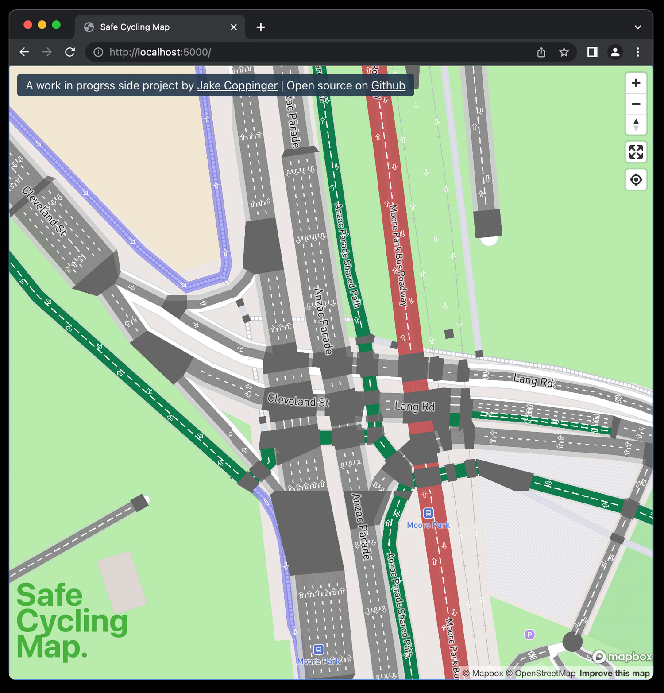

Safe Cycling Map
================

Work in progress! PRs and forks very welcome :)

A map of bike infrastructure using [osm2streets](https://github.com/a-b-street/osm2streets) output.

Uses [osm2streets-vector-tileserver](https://github.com/jakecoppinger/osm2streets-vector-tileserver),
a vector tileserver I wrote to generate Protobuf GeoJSON vector tiles using the JS bindings to
osm2streets (which is written in Rust).

# Local development

See instructions for setting up the backend tileserve at 
[https://github.com/jakecoppinger/osm2streets-vector-tileserver](https://github.com/jakecoppinger/osm2streets-vector-tileserver)

Install packages:
`nvm install`
`npm i`

Run dev server:
`npm run start`

Runs the app in the development mode. 
Open [http://localhost:3000](http://localhost:3000) to view it in the browser.

The page will reload if you make edits. 
You will also see any lint errors in the console.

### `npm run build`

Builds the app for production to the `build` folder. 
It bundles React in production mode and optimizes the build for the best performance.

# License
GNU GPL v3